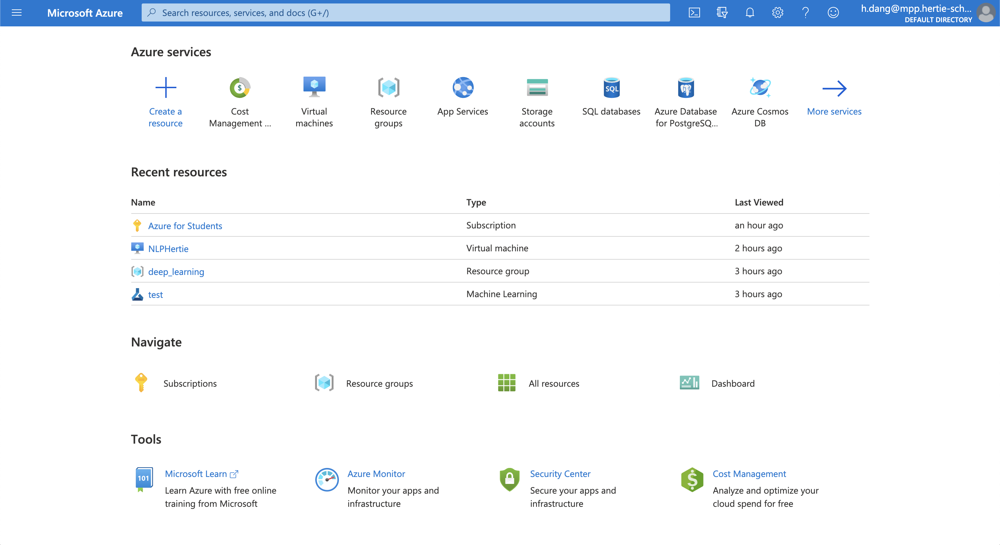
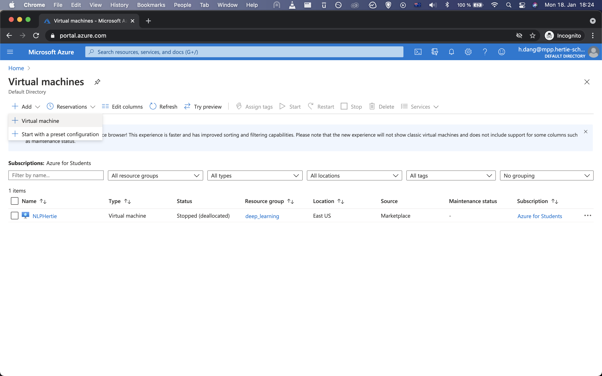
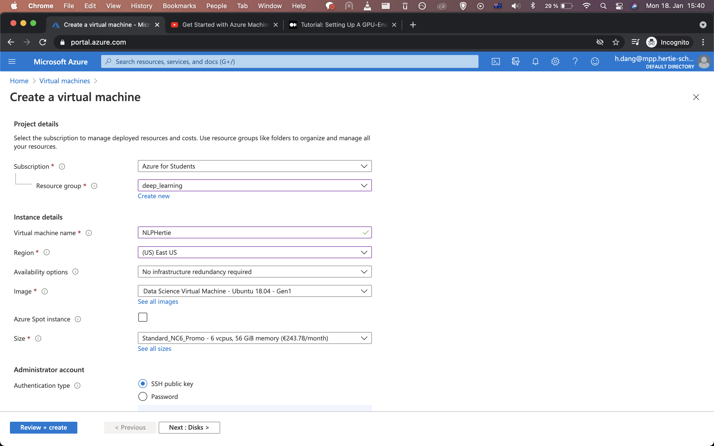
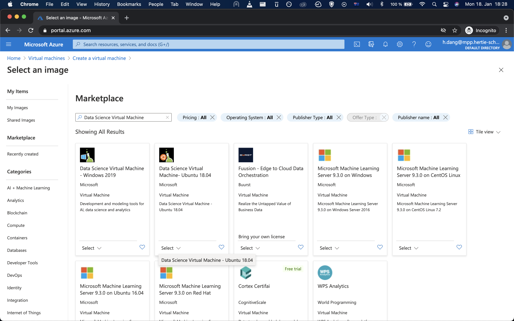

# Azure for Students Setup 

### Introduction

By signing up to Azure for Students with your institutional email, you will have access to $100 of Azure cloud credits and different learning materials to develop your cloud skills. Do not give your credit card information unless you want to purchase more credits and computing resources from the service. 

### Step 1: Setting Up Azure for Student Account

Visit: https://azure.microsoft.com/en-us/free/students/ and activate the account with your institutional email. 

Afterwards, you will have access to the Azure portal: 



### Step 2: Setting Up Data Science Virtual Machine

* Click on Virtual machines -> Select Add -> Virtual machine



* Choose a virtual machine name of your choice. For region, select (US) East US. 



For Image, select See all images -> in the Marketplace, search for Data Science Virtual Machine and select the Data Science Virtual Machine Ubuntu 18.04 Gen 1 (if you use MacOS or Linux) or Windows (if you use a Windows machine). 



* For Size, select See all sizes -> go to the search bar (Search by VM size) and search for NC6 (the VMs with GPU provision) -> Choose NC6_Promo.  

* For Authentication type, choose SSH public key, choose an unique username, then Review + Create. You will prompted to download an SSH key to your local machine (a file with .pem extension). Keep it a safe folder as it will be the key to access your remote virtual machine. 

### Step 3: Access your Virtual Machine from your local machine

After a few minutes, your Virtual Machine will be set up and you can start to use it. Click on Connect -> SSH 

You can then follow the steps indicated to connect your : 

* Fire up your terminal (or command prompt if you use Windows)
* Change file access level for the SSH private key file (the .pem file) with the following command:

```console
chmod 400 <private key path>
```

* Connect to your remote Virtual Machine on Azure:

```console
ssh -i <private key path> <user@server-instance> -L 8888:127.0.0.1:8888
```

8888 is the port on your local machine exclusively used by Jupyter Notebook. The -L 8888:127.0.0.1:8888 helps to create a tunnel from port 8888 in your local machine to port 127.0.0.1:8888 in the remote Virtual Machine. 

You will be asked: "Are you sure you want to continue connecting?" Type yes, and connection to the remote server on Azure will be established. 

### Step 4: Open a notebook kernel 

After everything is set up properly, you will have access to 6 different Python environment:
*    - py37_tensorflow                                                    
*    - py37_pytorch                                                       
*    - azureml_py36_tensorflow                                            
*    - azureml_py36_pytorch                                               
*    - azureml_py36_automl

The default environment is python37_default. You can switch to the other environment with the following command, depending on your need. Each environment will have a set of tools and libraries pre-installed and ready for your data science projects: 

```console
conda activate py37_tensorflow
```

To deactivate: 

```console
conda deactivate
```

To start up a Jupyter Notebook or Lab kernel: 

```console
jupyter notebook
```

or 

```console
jupyter lab
```

The notebook will be launched in port 127.0.0.1:8888, which you can visit by copying and pasting the link on the terminal to your browser. 

You can check the GPU is available in your notebook with: 

```python
import torch #if you use the pytorch environment

torch.cuda.is_available()
```

You can now freely experiment with GPU and Deep Learning on your remotely hosted Jupyter Notebook. It is recommended to delete all file storage after your experiments and stop your Virual Machine after you finish using it to prevent run-away cost (which can be quite expensive) for cloud services. 